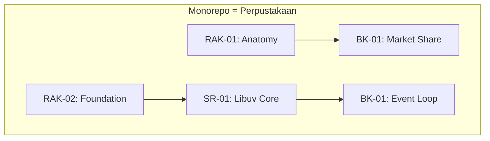

# Docs

Folder ini berisi seluruh dokumentasi lanjutan dan aturan monorepo untuk **Server Runtime Knowledge Base**.

## Konsep Monorepo (Analogi Perpustakaan)

- **Monorepo** = Perpustakaan
- **Rak** = Domain/tema besar
- **Sub-Rack (SR)** = Kategori spesifik di dalam rak (khusus RAK-02 ke atas)
- **Buku** = Modul/topik spesifik di dalam SR atau Rak

## Pemetaan
- [mapping.md](mapping.md)

## Tata Kelola
- [root-governance.md](root-governance.md)

## Panduan Sumber Bab
- [chapter-sourcing.md](chapter-sourcing.md)

## Referensi
- [references.md](references.md)

## Pemetaan Referensi
- [reference-mapping.md](reference-mapping.md)
